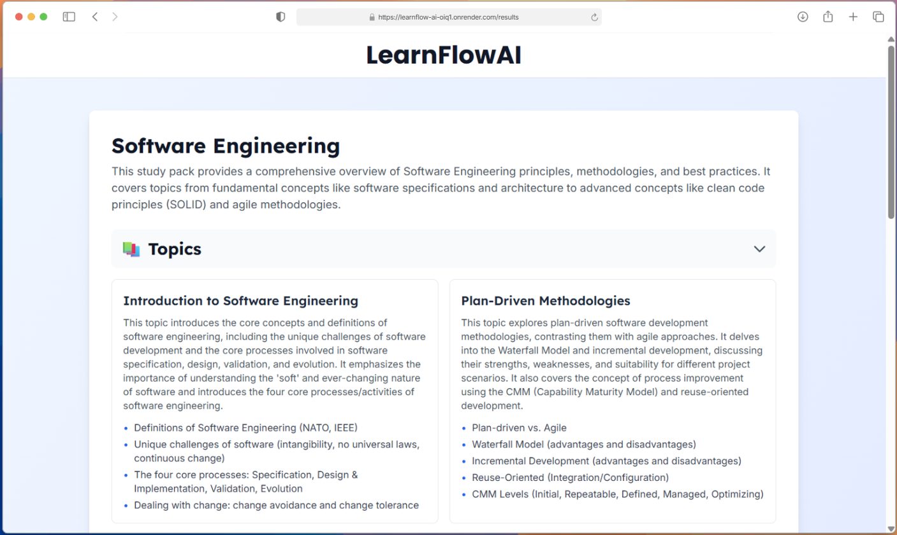

<a id="readme-top"></a>
<!--
*** ReadMe template from Othneil Drew @othneildrew on GitHub
-->
<!-- [![project_license][license-shield]][license-url]
[![LinkedIn][linkedin-shield]][linkedin-url] -->


<!-- PROJECT LOGO -->
<br />
<div align="center">
  <a href="https://github.com/alvagarciia/learnflow-ai">
    
  </a>

<h3 align="center">LearnFlow AI</h3>

  <p align="center">
    AI Study Agent | Transforms docs, slides, and text into interactive study packs
    <br />
    <br />
    <a href="https://github.com/alvagarciia/learnflow-ai/issues/new?labels=bug&template=bug-report---.md">Report Bug</a>
    &middot;
    <a href="https://github.com/alvagarciia/learnflow-ai/issues/new?labels=enhancement&template=feature-request---.md">Request Feature</a>
  </p>
</div>


<!-- TABLE OF CONTENTS -->
<details>
  <summary>Table of Contents</summary>
  <ol>
    <li>
      <a href="#about-the-project">About The Project</a>
      <ul>
        <li><a href="#features">Features</a></li>
        <li><a href="#built-with">Built With</a></li>
      </ul>
    </li>
    <li>
      <a href="#getting-started">Getting Started</a>
      <ul>
        <li><a href="#prerequisites">Prerequisites</a></li>
        <li><a href="#installation">Installation</a></li>
      </ul>
    </li>
    <li>
      <a href="#usage">Usage</a>
      <ul>
        <li><a href="#demo">Demo</a></li>
      </ul>
    </li>
    <li><a href="#contributing">Contributing</a></li>
    <li><a href="#license">License</a></li>
    <li><a href="#contact">Contact</a></li>
  </ol>
</details>


<!-- ABOUT THE PROJECT -->
## About The Project



LearnFlow AI is an intelligent study companion designed to break down dense course material into clear, structured study packs. It combines document understanding with smart content generation to make studying easier, faster, and more organized.

The goal is simple: take any class topic, syllabus, or set of notes and transform it into a comprehensive resource—including summaries, key concepts, practice problems, flashcards, and curated external links.

Under the hood, LearnFlow isn't just a wrapper. It utilizes an agentic workflow (built with Pydantic AI) to orchestrate context, validate outputs, and ensure that every study pack is structured perfectly for the user's needs.

<p align="right">(<a href="#readme-top">back to top</a>)</p>


### Features

- Agentic Workflow: Powered by Pydantic AI to intelligently parse, chunk, and synthesize complex course materials rather than just summarizing text.
- Multi-Modal Ingestion: Seamlessly processes PDFs, DOCX, PowerPoints, and raw text input to generate unified study guides.
- Structured Knowledge Output: Transforms unstructured lectures into strict, type-safe JSON formats for consistent summaries, flashcards, and quizzes.
- Distraction-Free UX: A clean, modern interface built with React + TypeScript and Tailwind CSS, designed to reduce cognitive load.
- Smart Resource Curation: Automatically generates "Further Reading" sections by identifying key topics and retrieving relevant external context.
- Resilient Error Handling: Backend-ready validation ensures that even large or complex files are processed smoothly without crashing the agent.

<p align="right">(<a href="#readme-top">back to top</a>)</p>


### Built With

[![React][react]](https://github.com/reactjs/react.dev)
[![Vite][vite]](https://github.com/vitejs/vite)
[![Tailwind CSS][tailwind]](https://github.com/tailwindlabs/tailwindcss)
[![Flask][flask]](https://flask.palletsprojects.com/en/stable/)
[![Pydantic AI][pydantic]](https://github.com/pydantic/pydantic-ai)
[![Google Gemini][gemini]](https://github.com/google-gemini)
[![Render][render]](https://github.com/renderinc)

<p align="right">(<a href="#readme-top">back to top</a>)</p>


<!-- GETTING STARTED -->
## Getting Started

> **⚠️ DEPLOYMENT BRANCH WARNING**  
> This branch is configured specifically for production deployment on Render and **cannot be run locally** as-is.
> 
> **For local development**, please switch to the [`main`](https://github.com/alvagarciia/learnflow-ai/tree/main) branch:
> ```sh
> git checkout main
> ```
> See the main branch README for local setup instructions.


<!-- USAGE EXAMPLES -->
## Usage

Once started, users can visit the site and start generating study material instantly — no login required.
They can:

1. Enter a topic, chapter, or class concept
2. (Optionally) upload files such as syllabi, notes, or slides
3. Select which type of outputs they want included
4. Generate a study pack in seconds

Each study pack is designed for real learning — with key points, summaries, flashcards, and problems that help students understand faster. The system is optimized to handle both short inputs and large documents, while keeping latency minimal.

<p align="right">(<a href="#readme-top">back to top</a>)</p>


### Demo


<p align="right">(<a href="#readme-top">back to top</a>)</p>


<!-- CONTRIBUTING -->
## Contributing

Contributions are what make the open source community such an amazing place to learn, inspire, and create. Any contributions you make are **greatly appreciated**.

If you have a suggestion that would make this better, please fork the repo and create a pull request. You can also simply open an issue with the tag "enhancement".
Don't forget to give the project a star! Thanks again!

1. Fork the Project
2. Create your Feature Branch (`git checkout -b feature/AmazingFeature`)
3. Commit your Changes (`git commit -m 'Add some AmazingFeature'`)
4. Push to the Branch (`git push origin feature/AmazingFeature`)
5. Open a Pull Request

<p align="right">(<a href="#readme-top">back to top</a>)</p>


<!-- LICENSE -->
## License

Distributed under the MIT License. See `LICENSE` for more information.

<p align="right">(<a href="#readme-top">back to top</a>)</p>


<!-- CONTACT -->
## Contact

Alvaro Garcia - [LinkedIn @alvaro-garciam](https://www.linkedin.com/in/alvaro-garciam) - alvaroedgamu@gmail.com

Project Link: [https://github.com/alvagarciia/learnflow-ai](https://github.com/alvagarciia/learnflow-ai)

<p align="right">(<a href="#readme-top">back to top</a>)</p>


<!-- MARKDOWN LINKS & IMAGES -->
<!-- https://www.markdownguide.org/basic-syntax/#reference-style-links -->
[license-shield]: https://img.shields.io/github/license/alvagarciia/learnflow-ai.svg?style=for-the-badge
[license-url]: https://github.com/alvagarciia/learnflow-ai/blob/main/LICENSE
[linkedin-shield]: https://img.shields.io/badge/-LinkedIn-black.svg?style=for-the-badge&logo=linkedin&colorB=555
[linkedin-url]: https://linkedin.com/in/alvaro-garciam


[react]: https://img.shields.io/badge/React-20232A?style=for-the-badge&logo=react&logoColor=61DAFB
[vite]: https://img.shields.io/badge/Vite-B73BFE?style=for-the-badge&logo=vite&logoColor=FFD62E
[tailwind]: https://img.shields.io/badge/Tailwind_CSS-38B2AC?style=for-the-badge&logo=tailwind-css&logoColor=white
[flask]: https://img.shields.io/badge/Flask-6BB5D7?style=for-the-badge&logo=flask&logoColor=white
[pydantic]: https://img.shields.io/badge/Pydantic_AI-E92063?style=for-the-badge&logo=pydantic&logoColor=white
[gemini]: https://img.shields.io/badge/google%20gemini-8E75B2?style=for-the-badge&logo=google%20gemini&logoColor=white
[render]: https://img.shields.io/badge/Render-8A05FF?style=for-the-badge&logo=render&logoColor=white